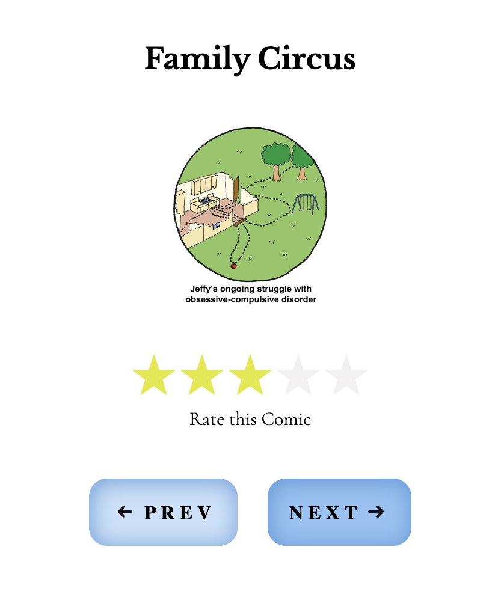

# xkcd-Comic-App

**Name:** Karen Rodriguez López

**Finish Date:** 06 de octubre de 2023

## Description technical test

- Consume the xkcd API: https://xkcd.com/json.html
- Create a screen to display random comics from the xkcd API.
- Allow the user to rate the comic.

## Built With 🛠👩🏻‍💻

- [Vue 3](https://reactnavigation.org) - Makes it easy to build interactive and reactive user interfaces.
- [Vite](https://reactnavigation.org) - Allows fast and efficient compilation.
- [Pinia](https://reactnavigation.org) - Allows you to manage the state in the app.
- [TypeScript](https://www.typescriptlang.org) - TypeScript is a strongly typed programming language that builds on JavaScript, giving you better tooling at any scale.
- [Axios](https://axios-http.com/docs/intro) - Axios is a promise-based HTTP Client for node.js.
- [vitest](https://vitest.dev/) - Unit and integration testing framework for Vue.js. It's fast, easy to use, and designed to work with Vite.

## Project Structure
```
..
└── src
   ├── __tests__
   │   ├── app.spec.ts
   |
   ├── assets
   │   ├── main.css
   │
   ├── components
   │   ├── __tests__
   │   ├── ComicViewer.vue
   │   ├── StarRating.vue
   │
   ├── stores
   │   ├── comiStore.ts
   │
   ├── utils
   │   ├── api.ts
   │
   ├── app.vue
   │
   ├── main.ts
   │

```

## Code Explanation

- __tests__: This folder contains test files. These tests ensure that different parts of the application work correctly. The file app.spec.ts contains tests to verify the functionality of the root component of the application, app.vue.

- __assets__: This is where the static resources of the application are stored, such as CSS styles. In this case, separating the styles into main.css makes it easier to manage and customize the application's layout.

- __components__: This folder groups the Vue.js components. In the context of this application, ComicViewer.vue handles the display of comics, while StarRating.vue provides the ability to rate the comics. Organizing the components in this way promotes code reusability and maintainability.

- __stores__: This directory houses the application's state management. The file comiStore.ts contains the definition and configuration of the store using pinia.

- __utils__: It contains utilities and helper functions used in various places in the application. The file api.ts contains functions for interacting with the xkcd API.

- __app.vue__: This file is the root component of the application. It defines the main structure and acts as a container for the other components. Here, the overall organization of the application is being established.

- __main.ts__: This file initializes the application, loads the root component (app.vue), and configures the state manager (pinia).

## Screenshots or Links



## Conclusions
One of the first challenges I encountered was determining which API to use and how to allow the comic to be changed. The project's shared link included two different API links, one referencing all comics and another for a specific one. After careful consideration, I decided which one to use and also defined the structure for my project. My goal was to adhere to best practices and use technologies that I am most familiar with, those that I consider most suitable for this type of project.

An interesting aspect was imagining and defining the user interface design. Unlike other projects where I often work with predefined designs, this time I had the freedom to imagine and create it from scratch. This allowed me to express my personal style and preferences.

## References

- API - (https://xkcd.com/info.0.json)


